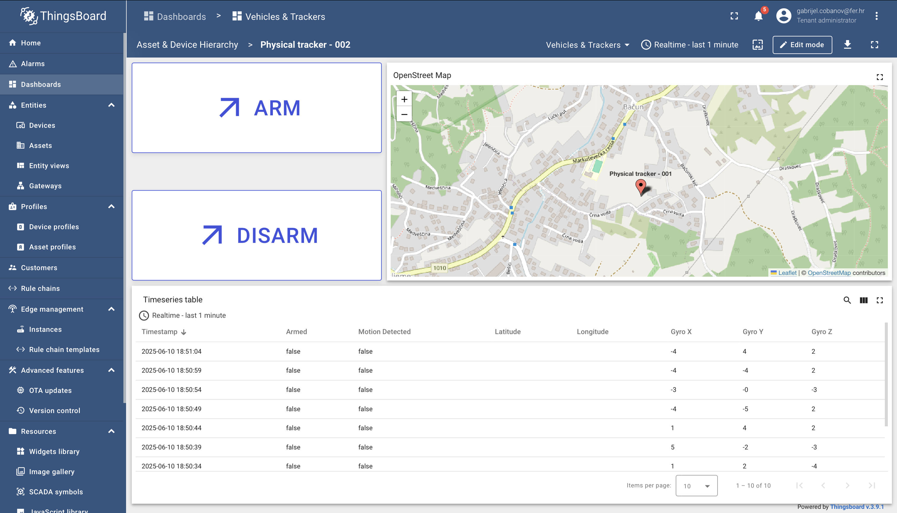
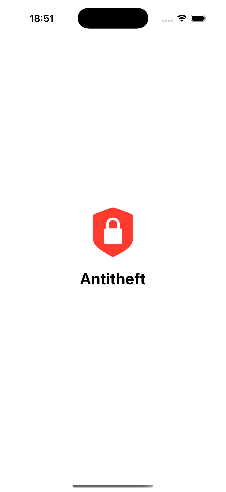
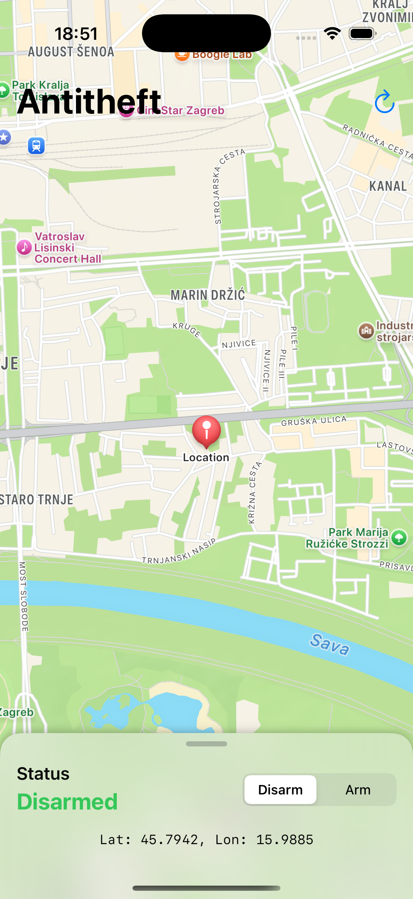
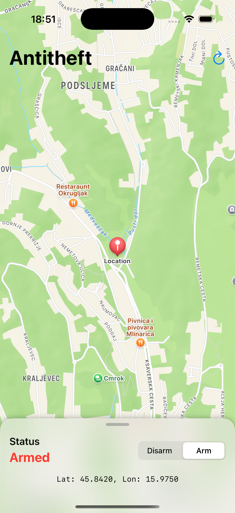
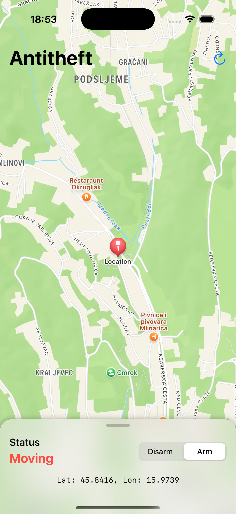

# Antitheft Device

> A full‑stack project combining an ESP32‑C6 motion‑sensing node, an open‑source ThingsBoard instance, and a SwiftUI iOS client.  
> It showcases how to build a low‑cost **antitheft tracker** with a live digital twin, real‑time alerts and remote arm/disarm control.

---

## Table of Contents
1. [Overview](#overview)
2. [System Architecture](#system-architecture)
3. [Hardware BOM](#hardware-bom)
4. [Firmware](#firmware)
5. [Mobile App (iOS)](#mobile-app-ios)
6. [IoT Platform (ThingsBoard)](#iot-platform-thingsboard)
7. [Quick Start](#quick-start)
8. [Project Structure](#project-structure)
9. [Acknowledgements](#acknowledgements)
10. [Screenshots](#screenshots)

---

## Overview

This repository contains everything you need to replicate the **Antitheft Device**:

* **Edge device** – an ESP32‑C6 DevKitC‑1 fitted with an MPU6050 6‑axis IMU, a red LED and a KY‑012 buzzer.  
* **Cloud back‑end** – a self‑hosted **ThingsBoard CE 3.x** instance acting as device registry, time‑series DB and rule engine.  
* **Mobile front‑end** – a minimalist **SwiftUI** app that visualises the tracker on a map and sends RPC commands to arm/disarm it.

When the device is _armed_ it continuously monitors acceleration. Sudden movement (>1.85 g) raises an alert: the buzzer sounds, the LED blinks and telemetry (gyro + mock GPS) is streamed to ThingsBoard every 5 s.  
The iOS app polls the twin and notifies the user in real time.

---

## System Architecture
                 +--------------------------+       +--------------------------+
                 |     ESP32‑C6 DevKit      |       |      Digital Twin        |
                 |     (Physical Device)    |       |   (Simulated Device)     |
                 +-----------+--------------+       +-----------+--------------+
                             |                                  |
                             |  MQTT v3.1.1                     |
                             +---------------+------------------+
                                             |
                                             ▼
                                  +-----------------------+
                                  |    ThingsBoard CE     |
                                  |  (Device Registry,    |
                                  |   Telemetry Broker)   |
                                  +-----------+-----------+
                                              |
                          REST API (JWT)      |     
                              +--------------+--------------+
                              |                             |
                              ▼                             ▼
              +--------------------------+     +--------------------------+
              |   SwiftUI iOS App        |     |   Additional Clients     |
              |  (Track + Arm/Disarm)    |     |  (optional dashboards)   |
              +--------------------------+     +--------------------------+

---

## Hardware BOM

* **ESP32‑C6 DevKitC‑1** – RISC‑V, 4 MB flash, Wi‑Fi 6 / BLE 5  
* **MPU6050** – 3‑axis accelerometer + 3‑axis gyro (I²C)  
* **LED** – 5 mm red, 1 kΩ series resistor (GPIO 5)  
* **KY‑012 Active Buzzer** – 5 V, GPIO 18  
* **Breadboard / wires / 5 V PSU**

> Total cost ≈ 20 € (2025).

---

## Firmware

* **Language** – C++17 on the Arduino layer of **ESP‑IDF v6**  
* **Telemetry schema**
  ```json
  {
    "motion_detected": true,
    "gyro_x": 12.3,
    "gyro_y": -4.5,
    "gyro_z": 0.8,
    "armed": true,
    "latitude": 45.8150,
    "longitude": 15.9819
  }
  ```
* **RPC** – `armDevice`, `disarmDevice` (ThingsBoard server‑side script)  


---

## Mobile App (iOS)

* **Swift 5.9 / SwiftUI / Combine**  
* `ThingsBoardAPI.swift` – tiny wrapper around TB REST & RPC endpoints  
* `DeviceViewModel.swift` – `@Observable` state with 1 s polling loop  
* Map rendered with **MapKit**; haptic feedback and local push on alert.

Build & run:

```bash
open iOS_app/Antitheft.xcodeproj
```

Target: iOS 17+, Apple Silicon or simulator.

---

## IoT Platform (ThingsBoard)

* Navigate to TB → login `tenant@thingsboard.org` / `tenant`.  
* Add *Device* “**ESP32‑Antitheft**” → copy **Access Token**.  

---

## Quick Start

1. **Wire hardware** according to `docs/wiring.png`.  
2. **Configure** `firmware/ESP32_anti_theft_device/ESP32_anti_theft.ino`  
   * `WIFI_SSID`, `WIFI_PASSWORD`  
   * `TB_DEVICE_TOKEN`, `TB_SERVER`  
3. **Flash** the ESP32‑C6.  
4. **Verify** telemetry appears on the ThingsBoard dashboard.  
5. **Run** the iOS app → tap **Arm**. Shake the board to trigger an alert!

---


## Project Structure

```
├── firmware/               # ESP32‑C6 source
│   └── /ESP32_anti_theft_device/ESP32_anti_theft.ino
├── iOS_app/
│   ├── /Antitheft/ThingsBoardAPI.swift
│   ├── /Antitheft/DeviceViewModel.swift
│   └── /Antitheft/DemoApp.swift
├── digital_win/             
│   ├── ESP32_anti_theft_digital_twin.py
└── docs/                   # Diagrams & screenshots
```


## Acknowledgements
* Seqjuriti team members
* [ThingsBoard](https://thingsboard.io/) for the awesome OSS IoT platform

---

## Screenshots

| Dashboard |
|-----------|
|  |

| Splash screen | Disarmed | Armed | Moving |
|-----------|------------|-----------|------------|
|  |  |  |  |

---

**Happy hacking!**
